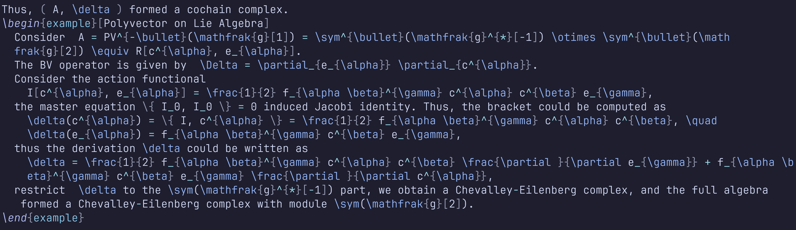
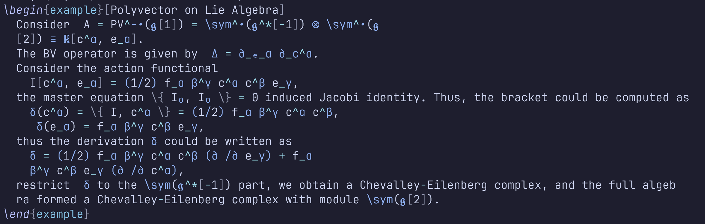
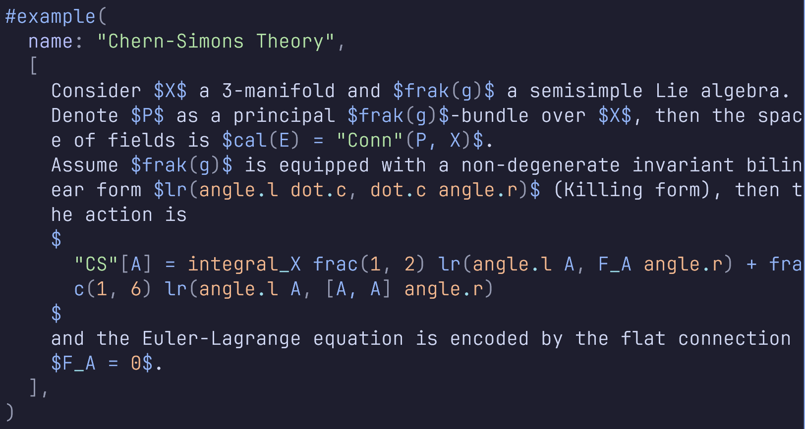
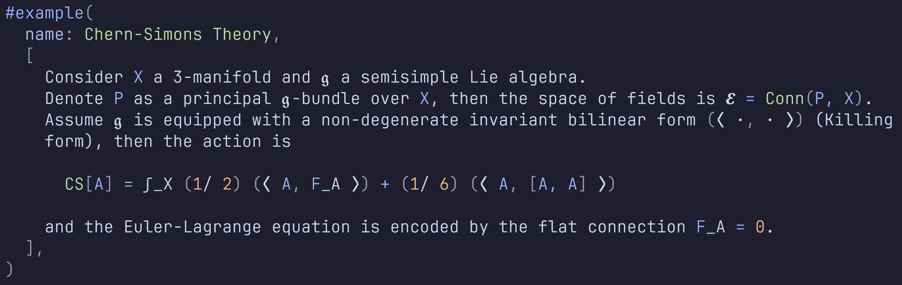

# math-conceal.nvim ☀️

Faster and More Precise [LaTeX](https://www.latex-project.org/) and [typst](https://github.com/typst/typst) conceal for [Neovim](https://github.com/neovim/neovim) with the power of [rust](https://www.rust-lang.org/).

<table style="width: 80%; margin: auto; text-align: center;">
  <tr>
    <td style="width: 50%;">
      <figure>
        
        <figcaption>LaTeX-Before</figcaption>
      </figure>
    </td>
    <td style="width: 50%;">
      <figure>
        
        <figcaption>LaTeX-After</figcaption>
      </figure>
    </td>
  </tr>
</table>


<table style="width: 80%; margin: auto; text-align: center;">
  <tr>
    <td style="width: 50%;">
      <figure>
        
        <figcaption>Typst-Before</figcaption>
      </figure>
    </td>
    <td style="width: 50%;">
      <figure>
        
        <figcaption>Typst-After</figcaption>
      </figure>
    </td>
  </tr>
</table>

## Introduction

In neovim `0.11.0`, the treesitter query has been changed to allow the asynchronous query, which allows us to use the treesitter query to conceal latex file. However, it's still slow while fully use `#set! conceal` directive since the expansive cost of query over the whole AST while conceal a single node.

The basic solution of the problem above comes from [latex.nvim](https://github.com/robbielyman/latex.nvim), who uses customized `set-pairs` directive to conceal the latex file. However, it still has some performance problem. The way to resolve the performance issue is considering a hash map to accelerate pattern matching, instead of matching conceal pattern inside AST query file.

## Features

- High performance conceal for LaTeX and typst files.
- Support multiple conceal patterns, including greek letters, script letters, math symbols, font styles, delimiters, and physical units.
- Multiple highlight groups for different conceal patterns, allowing you to customize the appearance of each pattern (all highlight groups can be found in [highlights](./highlights/highlights.md)).

## Installation

```lua
return {
  "pxwg/math-conceal.nvim",
  event = "VeryLazy",
  build = "make lua51",
  main = "math-conceal",
  --- @type LaTeXConcealOptions
  opts = {
    enabled = true,
    conceal = {
      "greek",
      "script",
      "math",
      "font",
      "delim",
      "phy",
    },
    ft = { "*.tex", "*.md", "*.typ" },
  },
}
```

## To-do

- [ ] Better support for typst files, and customizable conceal patterns.
- [ ] Commutative diagram conceal for Typst files.
- [ ] Table conceal for LaTeX and Typst files (inspired from [render-markdown.nvim](https://github.com/MeanderingProgrammer/render-markdown.nvim)).
- [ ] Automatically maintain the conceal query file and `math_symbols.json` file.
- [ ] Decoupling the `latex` part and `typst` part.

## References

- [ts_query_lsp](https://github.com/ribru17/ts_query_ls) I use this LSP as a pre-commit hook to format the query file.
