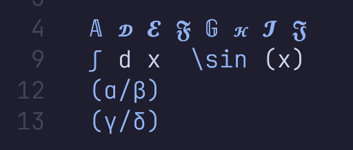

# latex-conceal.nvim ☀️

Faster and More Precise latex conceal.



## Introduction

In neovim `0.11.0`, the treesitter query has been changed to allow the asynchronous query, which allows us to use the treesitter query to conceal latex file. However, it's still slow while fully use `#set! conceal` directive since the expansive cost of query over the whole AST while conceal a single node.

The basic solution of the problem above comes from [latex.nvim](https://github.com/robbielyman/latex.nvim), who uses customized `set-pairs` directive to conceal the latex file. However, it still has some performance problem. The way to resolve the performance issue is consider a hash map to accelerate pattern matching, instead of matching conceal pattern inside AST query file.

## Installation

```lua
return {
  "pxwg/latex-conceal.nvim",
  event = "VeryLazy",
  build = "make lua51",
  --- @type LaTeXConcealOptions
  opts = {
    enabled = true,
    conceal = {
      "greek",
      "script",
      "math",
      "font",
      "delim",
    },
    ft = { "tex", "latex", "markdown" },
  },
}
```
