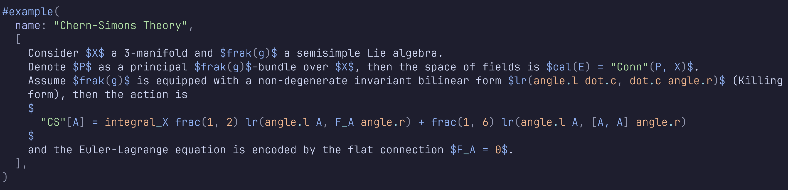

# math-conceal.nvim ☀️

基于 [rust](https://www.rust-lang.org/) 的强大功能，为 [Neovim](https://github.com/neovim/neovim) 提供更快、更精确的 [LaTeX](https://www.latex-project.org/) 和 [typst](https://github.com/typst/typst) 隐藏功能。

<table style="width: 80%; margin: auto; text-align: center;">
  <tr>
    <td style="width: 50%;">
      <figure>
        
        <figcaption>LaTeX-前</figcaption>
      </figure>
    </td>
    <td style="width: 50%;">
      <figure>
        
        <figcaption>LaTeX-后</figcaption>
      </figure>
    </td>
  </tr>
</table>

<table style="width: 80%; margin: auto; text-align: center;">
  <tr>
    <td style="width: 50%;">
      <figure>
        
        <figcaption>Typst-前</figcaption>
      </figure>
    </td>
    <td style="width: 50%;">
      <figure>
        
        <figcaption>Typst-后</figcaption>
      </figure>
    </td>
  </tr>
</table>

## 简介

在 neovim `0.11.0` 中，treesitter 查询已更改为允许异步查询，这使我们能够使用 treesitter 查询隐藏 LaTeX 文件。然而，完全使用 `#set! conceal` 指令时仍然很慢，因为在隐藏单个节点时对整个 AST 进行查询的开销很大。

上述问题的基本解决方案来自 [latex.nvim](https://github.com/robbielyman/latex.nvim)，它使用自定义的 `set-pairs` 指令来隐藏 LaTeX 文件。然而，它仍然存在一些性能问题。解决性能问题的方法是考虑使用哈希表来加速模式匹配，而不是在 AST 查询文件中匹配隐藏模式。

## 特性

- 高性能的 LaTeX 和 typst 文件隐藏功能。
- 支持多种隐藏模式，包括希腊字母、脚本字母、数学符号、字体样式、分隔符和物理单位。
- 多种高亮组用于不同的隐藏模式，允许您自定义每种模式的外观（所有高亮组可以在 [highlights](./highlights/highlights.md) 中找到）。

## 安装

```lua
return {
  "pxwg/math-conceal.nvim",
  event = "VeryLazy",
  main = "math-conceal",
  --- @type LaTeXConcealOptions
  opts = {
    enabled = true,
    conceal = {
      "greek",
      "script",
      "math",
      "font",
      "delim",
      "phy",
    },
    ft = { "*.tex", "*.md", "*.typ" },
  },
}
```

## 待办事项

- [ ] 更好地支持 typst 文件，并提供可自定义的隐藏模式。
- [ ] Typst 文件的交换图隐藏功能。
- [ ] LaTeX 和 Typst 文件的表格隐藏功能（灵感来自 [render-markdown.nvim](https://github.com/MeanderingProgrammer/render-markdown.nvim)）。
- [ ] 自动维护隐藏查询文件和 `math_symbols.json` 文件。
- [ ] 解耦 `latex` 部分和 `typst` 部分。

## 参考

- [ts_query_lsp](https://github.com/ribru17/ts_query_ls) 我使用这个 LSP 作为预提交钩子来格式化查询文件。
